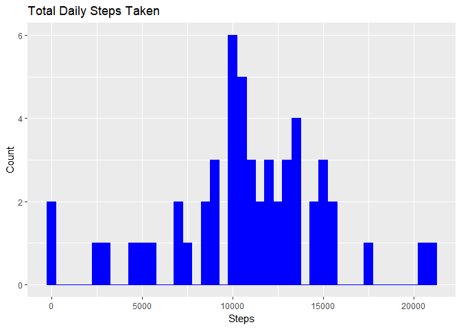
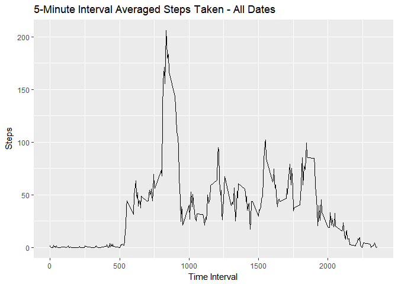
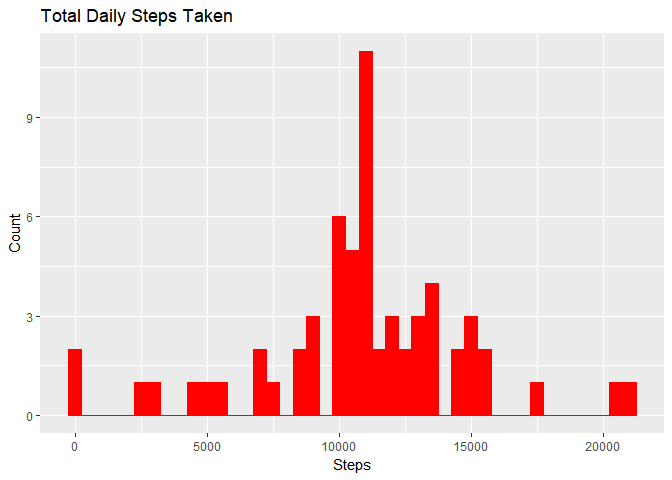
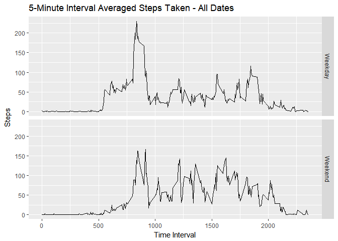

# Course Project 1

### Loading and preprocessing data
The first part of this assigment is to download the data zip file and correctly load the dataset into R before analysis can begin. The code that i used to accomplish this is as follows:


```r
dataurl <- "https://d396qusza40orc.cloudfront.net/repdata%2Fdata%2Factivity.zip"
temp <- tempfile()
download.file(dataurl,temp,method = "libcurl", mode = "wb")
unzip(temp,"activity.csv")
mydata <- read.table("activity.csv",header = TRUE,sep = ",")
unlink(temp)
mydata$date <- as.Date(mydata$date)
```

### What is the mean total number of steps taken per day?

The R code used and histogram produced is:


```r
library(ggplot2)
```

```
## Warning: package 'ggplot2' was built under R version 3.3.3
```

```r
daytotal <- aggregate(.~date, data=mydata, sum)
dailymean <- as.integer(mean(daytotal$steps))
dailymedian <- as.integer(median(daytotal$steps))
ggplot(data=daytotal, aes(daytotal$steps)) + geom_histogram(binwidth = 500, color = "blue", fill = "blue") + labs(title="Total Daily Steps Taken",x="Steps",y="Count")
```

<!-- -->

The Mean of the total number of steps taken each day is 10766, and the Median is 10765.  

### What is the average daily activity pattern?

The R code used to calculate this is:


```r
dap <- aggregate(.~interval, data = mydata, FUN = mean, simplify = TRUE, drop = TRUE)
maxstep <- as.integer(max(dap$steps))
maxrow <- which.max(dap$steps)
maxinterval <- dap$interval[maxrow]
ggplot(data=dap, aes(x=interval,y=steps)) + geom_line() +labs(title="5-Minute Interval Averaged Steps Taken - All Dates",x="Time Interval",y="Steps")
```

<!-- -->

From the calculation, the averaged maximum steps taken is 206, which occurs during the 835 time interval.  


### Imputing missing values

The next step was to calculate the total "steps" that had a "NA" value.

```r
totna <- sum(is.na(mydata$steps))
```

The total number of missing values in the dataset are 2304.

Next, the new dataset is created which will replace the "NA" values.


```r
library(plyr)
impute.mean <- function(x) replace (x, is.na(x), mean(x, na.rm = TRUE))
newdata <- ddply(mydata, ~ interval, transform, steps = impute.mean(steps))
nas <- sum(is.na(newdata))
```

The new dataset has now been created which features the average number of steps that occured during that timestep on all days, instead of "NA". The total number of timesteps that do not have any data is 0. These will occur when no movement was detected throughout any of the time intervals of that value throughout all days.


```r
newdaytotal <- aggregate(.~date, data=newdata, sum)
newdailymean <- as.integer(mean(newdaytotal$steps))
newdailymedian <- as.integer(median(newdaytotal$steps))
ggplot(data=newdaytotal, aes(newdaytotal$steps)) + geom_histogram(binwidth = 500, color = "red", fill = "red") + labs(title="Total Daily Steps Taken",x="Steps",y="Count")
```

<!-- -->

The new daily mean is 10766 and the new daily median is 10766. These values are not significantly different from before.

### Are there any differences in activity patterns between weekdays and weekends?

The R code for this calculation is:


```r
library(timeDate)
```

```
## Warning: package 'timeDate' was built under R version 3.3.3
```

```r
newdata$daytype <- isWeekday(newdata$date)
newdap <- aggregate(.~interval+daytype, data = newdata, FUN = mean, simplify = TRUE, drop = TRUE)
newdap$daytype[newdap$daytype == TRUE] <- "Weekday"
newdap$daytype[newdap$daytype == FALSE] <- "Weekend"
ggplot(data=newdap, aes(x=interval,y=steps)) + geom_line() +labs(title="5-Minute Interval Averaged Steps Taken - All Dates",x="Time Interval",y="Steps")+facet_grid(daytype~.)
```

<!-- -->
End of report.
